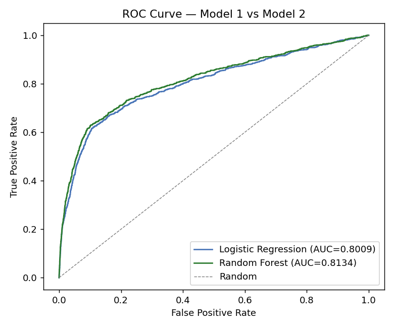
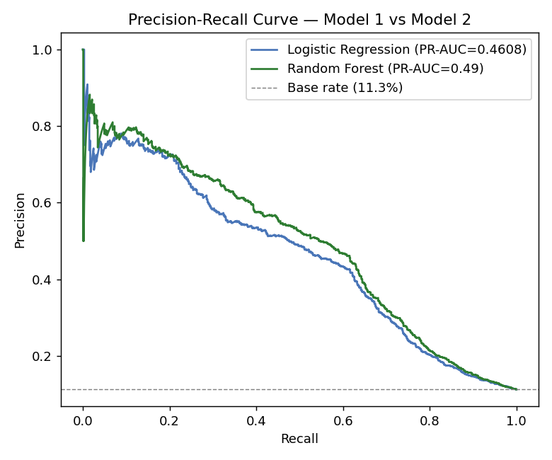

# Comparison — Model 1 vs Model 2

**Relevant script:** [`scripts/comparison.py`](scripts/comparison.py)

**How to reproduce** (run the two model scripts first, then):
```bash
python scripts/model1_logistic_regression.py
python scripts/model2_random_forest.py
python scripts/comparison.py
```
Outputs: `experiments/results/comparison_metrics.csv`, `comparison_roc.png`,
`comparison_pr.png`.

---

## Side-by-side metrics (test set)

| Metric | Model 1 — Logistic Regression | Model 2 — Random Forest | Winner |
|--------|:---:|:---:|:---:|
| Accuracy | 0.8337 | **0.8581** | Random Forest |
| Balanced accuracy | 0.7529 | **0.7615** | Random Forest |
| Precision (yes) | 0.3657 | **0.4153** | Random Forest |
| Recall (yes) | **0.6487** | 0.6369 | Logistic Regression |
| F1 (yes) | 0.4678 | **0.5028** | Random Forest |
| ROC-AUC | 0.8009 | **0.8134** | Random Forest |
| PR-AUC | 0.4608 | **0.4900** | Random Forest |

**Random Forest wins 6 of 7 metrics**; logistic regression wins only on recall,
and only marginally (0.649 vs 0.637).

## ROC and Precision-Recall curves




The random forest's ROC curve sits above the logistic regression's across almost
the entire range, and its PR curve is higher — both confirming stronger ranking
performance. Both models sit well above the 11.3% base rate on the PR plot.

## Statistical / practical reading

- The two models achieve **near-identical recall**, so the decisive difference is
  **precision**: the random forest reaches the same number of true subscribers
  with **~200 fewer false positives**, which in a real campaign means less wasted
  contact cost per genuine conversion.
- The gap is **consistent but modest** (ROC-AUC +0.012). This tells us the signal
  in this dataset is largely linear/additive, but non-linear interactions captured
  by the forest add a small, real improvement.
- The random forest trades away some interpretability for this gain — a trade-off
  discussed in the recommendations report (Part D).

## Verdict

**Model 2 (Random Forest) is the recommended model** on overall discrimination
(ROC-AUC, PR-AUC), precision and F1, while remaining competitive on recall. The
full justification, improvement plan and adaptation to STADIOEquities' own data
are set out in [`reports/SS2_Recommendations.pdf`](reports/SS2_Recommendations.pdf).
