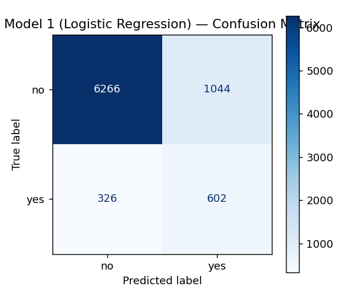
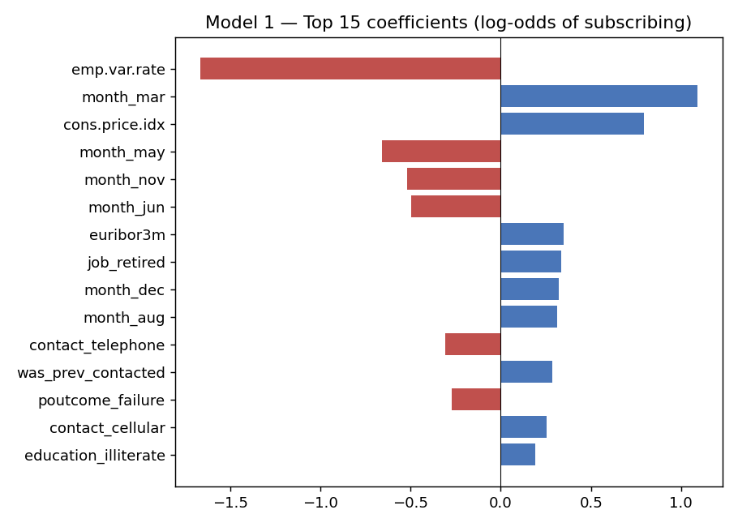

# Model 1 Performance — Logistic Regression

**Relevant script:** [`scripts/model1_logistic_regression.py`](scripts/model1_logistic_regression.py)
(performance is computed by `compute_metrics()` in
[`scripts/stats/eval_utils.py`](scripts/stats/eval_utils.py)).

**How to reproduce**
```bash
python scripts/model1_logistic_regression.py
```
Metrics are saved to `experiments/results/model1_logistic_metrics.json`; figures
to the same folder.

---

## Results on the held-out test set (8,238 rows, 20% stratified hold-out)

| Metric | Value |
|--------|-------|
| Accuracy | 0.8337 |
| Balanced accuracy | 0.7529 |
| Precision (yes) | 0.3657 |
| Recall (yes) | 0.6487 |
| F1 (yes) | 0.4678 |
| **ROC-AUC** | **0.8009** |
| PR-AUC (average precision) | 0.4608 |

**Confusion matrix**

|  | Predicted no | Predicted yes |
|--|--------------|---------------|
| **Actual no** | TN = 6266 | FP = 1044 |
| **Actual yes** | FN = 326 | TP = 602 |



## Interpretation

- With `class_weight='balanced'`, the model prioritises **recall on the minority
  class**: it correctly identifies **64.9%** of clients who actually subscribed
  (602 of 928), at the cost of 1,044 false positives.
- **Accuracy (0.83) is not the headline metric** — a naïve "predict everyone says
  no" model would score ~0.89 accuracy yet catch zero subscribers. **ROC-AUC
  (0.80)** and **balanced accuracy (0.75)** show the model discriminates well
  above chance, which is the point that matters for targeting.
- Excluding the leaky `duration` feature means these numbers are **honest and
  deployable**; they are consistent with the ~0.80 AUC reported in the literature
  for duration-free models (Moro *et al.*, 2014).

## Most influential features (log-odds)

The coefficient plot (`experiments/results/model1_coefficients.png`) shows the
macro-economic indicators (`euribor3m`, `nr.employed`, `emp.var.rate`) and
`poutcome_success` / `was_prev_contacted` as the strongest drivers — clients are
far more likely to subscribe when a previous campaign succeeded and in particular
economic conditions.


