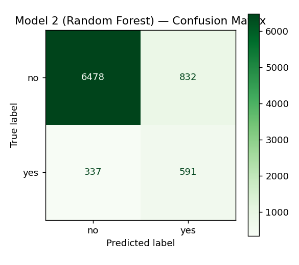
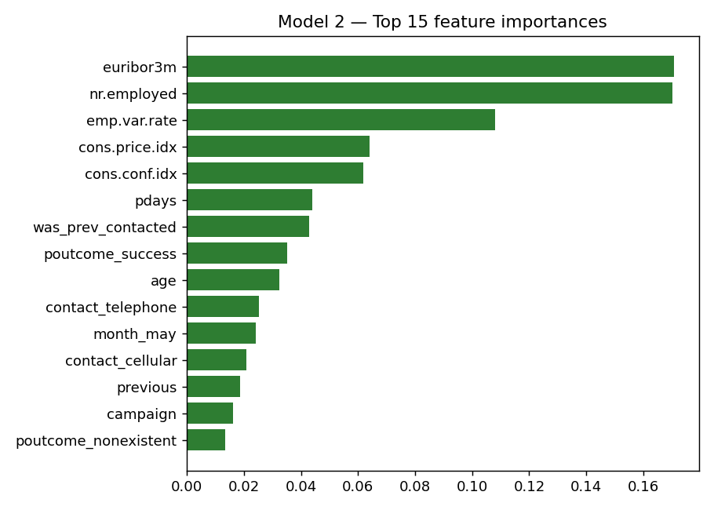

# Model 2 Performance — Random Forest

**Relevant script:** [`scripts/model2_random_forest.py`](scripts/model2_random_forest.py)
(performance is computed by `compute_metrics()` in
[`scripts/stats/eval_utils.py`](scripts/stats/eval_utils.py)).

**How to reproduce**
```bash
python scripts/model2_random_forest.py
```
Metrics are saved to `experiments/results/model2_rf_metrics.json`; figures to the
same folder.

---

## Results on the held-out test set (8,238 rows, 20% stratified hold-out)

| Metric | Value |
|--------|-------|
| Accuracy | 0.8581 |
| Balanced accuracy | 0.7615 |
| Precision (yes) | 0.4153 |
| Recall (yes) | 0.6369 |
| F1 (yes) | 0.5028 |
| **ROC-AUC** | **0.8134** |
| PR-AUC (average precision) | 0.4900 |

**Confusion matrix**

|  | Predicted no | Predicted yes |
|--|--------------|---------------|
| **Actual no** | TN = 6478 | FP = 832 |
| **Actual yes** | FN = 337 | TP = 591 |



## Interpretation

- The random forest catches **63.7%** of true subscribers (591 of 928) while
  generating **fewer false positives (832 vs 1,044)** than logistic regression —
  i.e. similar recall at **higher precision (0.42 vs 0.37)**.
- It achieves the **best ROC-AUC (0.813)** and **PR-AUC (0.49)** of the two
  models, meaning better ranking of clients by subscription likelihood — exactly
  what is needed to prioritise a marketing/onboarding list.
- The tuned model is deliberately **shallow** (`max_depth=10`,
  `min_samples_leaf=5`), which controls the variance/overfitting risk that
  unconstrained trees are prone to (bias–variance trade-off).

## Most important features

The importance plot (`experiments/results/model2_feature_importance.png`) ranks
`euribor3m`, `nr.employed` and `emp.var.rate` highest, followed by
`cons.price.idx`, `cons.conf.idx`, `pdays`, `was_prev_contacted` and
`poutcome_success`. This agrees with Model 1's coefficients and with the
literature: **macro-economic context and prior-contact outcome dominate**.


